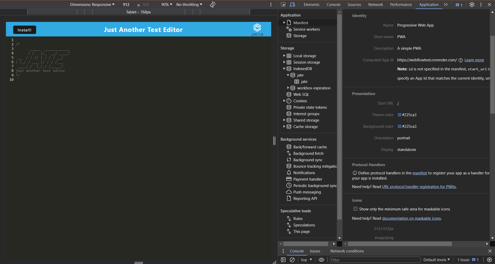

# WebFlowText

## Description

As a developer I wanted to create a note app with or without having to use internet connection, so that I can retrieve the data to use later.
Some things that I learned while working on this project was using the webpack file along with using many other files in order to be able to install the application and be able to run it without having to use internet.

## Table of Contents

If your README is long, add a table of contents to make it easy for users to find what they need.

- [Installation](#installation)
- [Usage](#usage)
- [Credits](#credits)
- [License](#license)

## Installation

1. Clone repo: https://github.com/JosueHernand/WebFlowText
2. Open with your code editor and run the following in your terminal `npm i` to install all packages required for the app.

## Usage

Demo Video [Click Here](https://drive.google.com/file/d/1ssu8rjkXiqz5Rn50bX4EH7fcSRK_SP3x/view)  

Website Deployment [Click Here](https://webflowtext.onrender.com)  

  

  

  

## Credits

N/A

## License

Used MIT License 
